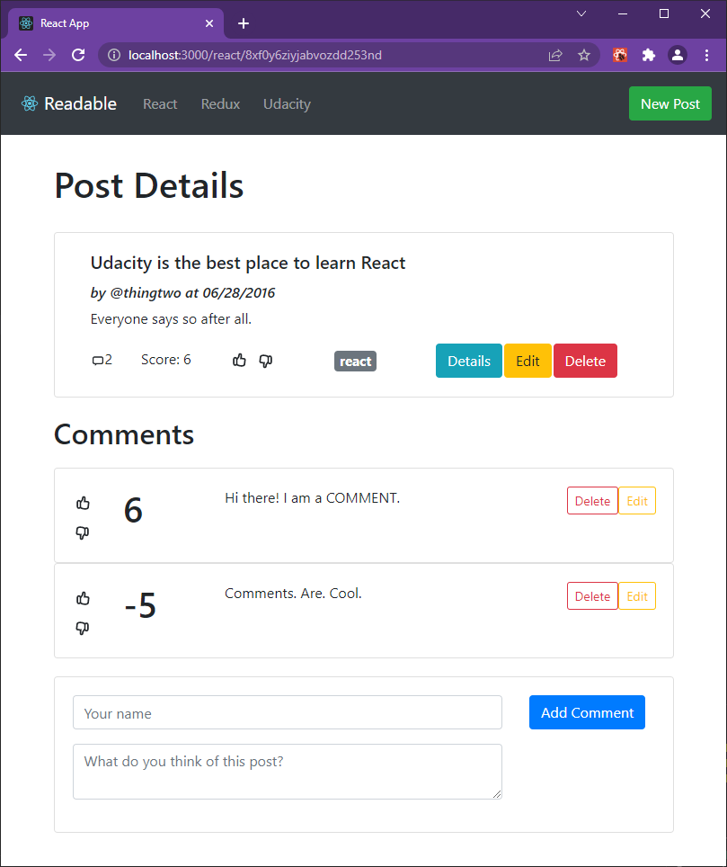

# React Readable

My implementation of the Readable App for Udacity React Course certification.



<hr>

## Getting started

You should only need Node.js to start the app:

```bash
# api
npm install --prefix api-server
node api-server/server

# frontend
cp frontend/.config/localhost.env frontend/.env
npm install --prefix frontend
npm start --prefix frontend
```

Application should be available locally at http://localhost:3000